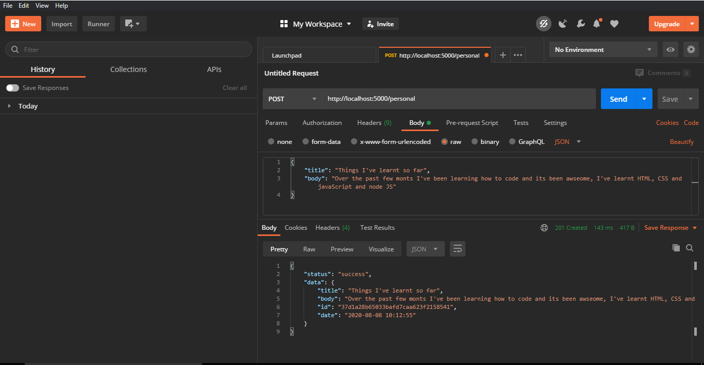

## NoteApp

## Welcome! 👋

This is a note taking app API built with node core modules.

There are four primary directories for notes in this API and they are `events`,`personal`,`work` and `others`.

- _crete directories_
- _list directories_
- _create notes_
- _read notes_
- _update notes_
- _delete notes_

To use this API;

- clone the [repo](https://github.com/AmosSpark/NoteApp.git).
- run `node server.js` from the command line.
- use the [documentation](https://documenter.getpostman.com/view/10431360/T1LJm8wh?version=latest).
